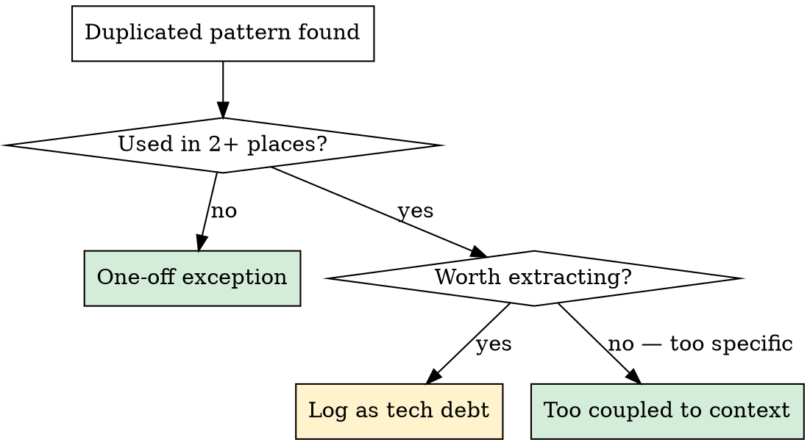

# Audit Code Reuse

Scan frontend or backend for reinvented patterns that should use shared infrastructure, and for repeated code that should be extracted.

## Arguments

- `/audit_reuse frontend` — audit frontend component reuse
- `/audit_reuse backend` — audit backend service/utility reuse
- `/audit_reuse` (no argument) — **ask the user** which system to audit

## When to Use

- After a feature lands that added new UI or endpoints
- Periodic codebase hygiene check
- Before a major milestone or release
- User suspects duplication ("are we reusing components?", "are we duplicating logic?")

**Don't use when:** The user wants to implement a fix (use `/implement_task` after findings are logged).

---

## Frontend Audit

### Quick Reference: Shared Component Library

#### Primitives (`lib/components/ui/`)

| Component | Use for | Import from |
|---|---|---|
| `Button` | All clickable actions | `$lib/components/ui/button` |
| `Dialog` | Modals, confirmations, forms | `$lib/components/ui/dialog` |
| `ConfirmDialog` | Yes/no confirmation prompts | `$lib/components/ui/confirm-dialog.svelte` |
| `Card` | Content containers with headers | `$lib/components/ui/card` |
| `Table` | Data tables | `$lib/components/ui/table` |
| `DropdownMenu` | Action menus, option lists | `$lib/components/ui/dropdown-menu` |
| `ContextMenu` | Right-click menus | `$lib/components/ui/context-menu` |
| `Input` / `Textarea` | Text fields | `$lib/components/ui/input`, `textarea` |
| `Badge` | Status labels, tags | `$lib/components/ui/badge` |
| `Tooltip` | Hover hints | `$lib/components/ui/tooltip` |
| `Popover` | Floating content panels | `$lib/components/ui/popover` |
| `Sonner` | Toast notifications | `$lib/components/ui/sonner` |

#### Feature Components (`lib/components/`)

`ResponsiveTable`, `MarkdownRenderer`, `DocumentUploadDialog`, `ImageGallery`, `PdfPreviewDrawer`, `VersionHistoryDrawer`, `ChatPanel`

### Frontend Process

#### 1. Scan for raw HTML that should use primitives

```bash
# Raw <button> with Tailwind instead of Button component
grep -rn '<button[^>]*class=' frontend/src/ --include='*.svelte'

# Raw <table> instead of Table component
grep -rn '<table[^>]*class=' frontend/src/ --include='*.svelte'

# Hand-rolled modals (divs with backdrop/overlay classes)
grep -rn 'fixed inset-0\|z-50.*bg-black/\|backdrop' frontend/src/ --include='*.svelte'

# Inline confirm() or window.confirm() instead of ConfirmDialog
grep -rn 'window\.confirm\|confirm(' frontend/src/ --include='*.svelte'
```

Flag each hit. Check whether the component imports from `$lib/components/ui/` — if it doesn't, it's likely reinvented.

#### 2. Scan for repeated patterns across pages

Look for UI patterns that appear on 2+ pages but aren't extracted:

- **Loading states**: `{#if loading}` with inline spinners vs a shared `LoadingSpinner`
- **Error states**: `{#if error}` with inline error messages vs a shared `ErrorBanner`
- **Empty states**: "No items found" messages repeated across list pages
- **Page headers**: Title + description + action button repeated per page
- **List-with-search**: Search input + filtered list repeated in multiple pages

```bash
# Loading spinner patterns
grep -rn '{#if loading}' frontend/src/routes/ --include='*.svelte' -l

# Error display patterns
grep -rn '{#if error}' frontend/src/routes/ --include='*.svelte' -l
```

#### 3. Classify and report

Use the classification flowchart and reporting table from the **Classification** section below.

---

## Backend Audit

### Quick Reference: Shared Infrastructure

#### Dependencies (`core/deps.py`)

| Utility | Use for | Instead of |
|---|---|---|
| `Depends(get_db)` | DB sessions in endpoints | Manual `AsyncSession` creation |
| `Depends(get_current_user)` | Auth in endpoints | Manual token decoding |
| `Depends(require_permission(...))` | RBAC gating | Inline permission checks |
| `Depends(require_tier(...))` | Subscription gating | Manual tier checks |
| `get_or_404(db, Model, id)` | Fetch-or-raise | Manual query + `if not found: raise 404` |

#### Model Mixins (`models/mixins.py`)

| Mixin | Provides |
|---|---|
| `UUIDMixin` | Auto-generated UUID `id` primary key |
| `TimestampMixin` | `created_at` and `updated_at` with server defaults |

#### Services

| Service | Use for | Instead of |
|---|---|---|
| `log_audit()` | Change tracking on CRUD ops | No audit trail, or hand-rolled logging |
| `check_permission()` | Programmatic RBAC evaluation | Inline role/permission logic |
| `get_model(capability, db, org_id)` | AI provider resolution | Hardcoded provider/model strings |
| `settings` (from `core/config`) | All configuration access | Direct `os.environ` reads |
| `FileStorageService` | File upload/download | Manual file path handling |
| `get_task_runner().submit()` | Background tasks | Inline `asyncio.create_task()` |
| `embed_texts()` / `embed_query()` | Embedding generation | Direct API calls to embedding providers |
| `hash_password()` / `verify_password()` | Password ops | Direct bcrypt usage |

### Backend Process

#### 1. Scan for bypassed shared infrastructure

```bash
# Direct os.environ instead of settings
grep -rn 'os\.environ\|os\.getenv' backend/app/ --include='*.py' | grep -v config.py

# Manual session creation instead of Depends(get_db)
grep -rn 'AsyncSession(' backend/app/ --include='*.py' | grep -v 'session.py\|conftest\|test_'

# Manual 404 pattern instead of get_or_404()
grep -rn 'raise HTTPException.*404\|status_code=404' backend/app/ --include='*.py'

# Hardcoded AI model/provider strings
grep -rn "openai\|anthropic\|ollama" backend/app/services/ --include='*.py' | grep -v 'ai_config.py\|__pycache__'

# Inline permission checks instead of require_permission()
grep -rn 'permission_level\|PermissionLevel' backend/app/api/endpoints/ --include='*.py' | grep -v 'Depends'
```

#### 2. Scan for missing shared patterns

```bash
# CRUD endpoints without audit logging
grep -rn 'db\.commit()' backend/app/api/endpoints/ --include='*.py' -l
# Then check which of those files DON'T import log_audit:
grep -rL 'log_audit' backend/app/api/endpoints/ --include='*.py'

# Models missing standard mixins
grep -rn 'class.*Base):' backend/app/models/ --include='*.py'
# Check which don't use UUIDMixin or TimestampMixin

# Direct asyncio.create_task instead of task_runner
grep -rn 'asyncio\.create_task' backend/app/ --include='*.py' | grep -v 'task_runner.py'
```

#### 3. Scan for repeated patterns across endpoints

Look for logic that appears in 2+ endpoint files but isn't extracted:

- **Pagination**: Manual offset/limit handling vs a shared pattern
- **List filtering**: Repeated query filter construction
- **Bulk operations**: Similar loops across multiple endpoints
- **Response formatting**: Repeated dict/list comprehensions for response shaping

#### 4. Classify and report

Use the classification flowchart and reporting table from the **Classification** section below.

---

## Classification



**One-off exceptions are fine when:**
- The code is deeply coupled to endpoint/page-specific state
- Extracting would require passing 5+ params or complex callbacks
- It's a temporary prototype that will be revisited

### Report findings

Present a table:

```
| Location | Issue | Severity | Action |
|----------|-------|----------|--------|
| endpoints/projects.py:42 | Manual 404 instead of get_or_404() | Low | Replace |
| endpoints/runs.py:88 | Inline permission check bypassing require_permission() | Med | Use dependency |
| 4 endpoints: projects, runs, protocols, library | No audit logging on delete | High | Add log_audit() |
```

### Severity

**Frontend:**
- **High**: Hand-rolled modal/dialog (accessibility, focus trap, escape key all missing)
- **Medium**: Repeated pattern across 3+ pages, or raw HTML replacing a component with behavior
- **Low**: Raw HTML that's purely visual in a one-off context

**Backend:**
- **High**: Bypassed security infrastructure (manual auth, missing permission checks, direct `os.environ` for secrets)
- **Medium**: Missing audit logging on mutations, repeated logic across 3+ endpoints, bypassed shared services
- **Low**: Manual 404 raises in one-off endpoints, minor style inconsistencies

### Offer next steps

Ask: "Want me to log these as tech debt via `/add_task`, or fix the high/medium ones now?"

## Common Mistakes

- **Flagging everything**: Not every manual pattern is wrong. Only flag what's truly duplicated or bypassing shared behavior that provides real value (safety, consistency, audit trail).
- **Ignoring accessibility** (frontend): Hand-rolled modals are high severity because they miss focus trapping, escape-to-close, and aria attributes that `Dialog` provides.
- **Ignoring security** (backend): Bypassed auth/permission infrastructure is high severity even if it "works" — it's a security gap.
- **Over-extracting**: A pattern used once with highly specific context isn't worth extracting. The threshold is 2+ usages with similar shape.
