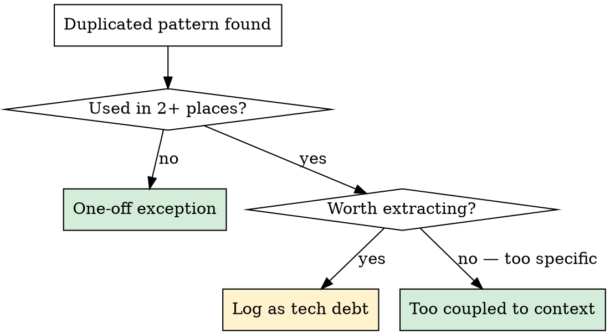

# Audit Frontend Component Reuse

Scan the frontend for reinvented UI that should use shared components, and for repeated patterns that should be extracted.

## When to Use

- After a feature lands that added new frontend UI
- Periodic codebase hygiene check
- Before a major frontend milestone or release
- User suspects duplication ("are we reusing components?")

**Don't use when:** Auditing backend code (this is frontend-only) or when the user wants to implement a fix (use `/implement_task` after findings are logged).

## Quick Reference: Shared Component Library

### Primitives (`lib/components/ui/`)

| Component | Use for | Import from |
|---|---|---|
| `Button` | All clickable actions | `$lib/components/ui/button` |
| `Dialog` | Modals, confirmations, forms | `$lib/components/ui/dialog` |
| `ConfirmDialog` | Yes/no confirmation prompts | `$lib/components/ui/confirm-dialog.svelte` |
| `Card` | Content containers with headers | `$lib/components/ui/card` |
| `Table` | Data tables | `$lib/components/ui/table` |
| `DropdownMenu` | Action menus, option lists | `$lib/components/ui/dropdown-menu` |
| `ContextMenu` | Right-click menus | `$lib/components/ui/context-menu` |
| `Input` / `Textarea` | Text fields | `$lib/components/ui/input`, `textarea` |
| `Badge` | Status labels, tags | `$lib/components/ui/badge` |
| `Tooltip` | Hover hints | `$lib/components/ui/tooltip` |
| `Popover` | Floating content panels | `$lib/components/ui/popover` |
| `Sonner` | Toast notifications | `$lib/components/ui/sonner` |

### Feature Components (`lib/components/`)

`ResponsiveTable`, `MarkdownRenderer`, `DocumentUploadDialog`, `ImageGallery`, `PdfPreviewDrawer`, `VersionHistoryDrawer`, `ChatPanel`

## Process

### 1. Scan for raw HTML that should use primitives

```bash
# Raw <button> with Tailwind instead of Button component
grep -rn '<button[^>]*class=' frontend/src/ --include='*.svelte'

# Raw <table> instead of Table component
grep -rn '<table[^>]*class=' frontend/src/ --include='*.svelte'

# Hand-rolled modals (divs with backdrop/overlay classes)
grep -rn 'fixed inset-0\|z-50.*bg-black/\|backdrop' frontend/src/ --include='*.svelte'

# Inline confirm() or window.confirm() instead of ConfirmDialog
grep -rn 'window\.confirm\|confirm(' frontend/src/ --include='*.svelte'
```

Flag each hit. Check whether the component imports from `$lib/components/ui/` -- if it doesn't, it's likely reinvented.

### 2. Scan for repeated patterns across pages

Look for UI patterns that appear on 2+ pages but aren't extracted:

- **Loading states**: `{#if loading}` with inline spinners vs a shared `LoadingSpinner`
- **Error states**: `{#if error}` with inline error messages vs a shared `ErrorBanner`
- **Empty states**: "No items found" messages repeated across list pages
- **Page headers**: Title + description + action button repeated per page
- **List-with-search**: Search input + filtered list repeated in multiple pages

```bash
# Loading spinner patterns
grep -rn '{#if loading}' frontend/src/routes/ --include='*.svelte' -l

# Error display patterns
grep -rn '{#if error}' frontend/src/routes/ --include='*.svelte' -l
```

### 3. Classify each finding



**One-off exceptions are fine when:**
- The component is deeply coupled to page-specific state
- Extracting would require passing 5+ props or complex callbacks
- It's a temporary prototype that will be revisited

### 4. Report findings

Present a table:

```
| Location | Issue | Severity | Action |
|----------|-------|----------|--------|
| routes/projects/+page.svelte:42 | Raw <button> instead of Button | Low | Replace |
| routes/runs/[id]/+page.svelte:88 | Hand-rolled confirmation dialog | Med | Use ConfirmDialog |
| 3 pages: projects, runs, library | Identical loading spinner pattern | Med | Extract LoadingSpinner |
```

Severity:
- **High**: Hand-rolled modal/dialog (accessibility, focus trap, escape key all missing)
- **Medium**: Repeated pattern across 3+ pages, or raw HTML replacing a component with behavior (Button variants, Table sorting)
- **Low**: Raw HTML that's purely visual (a simple `<button>` in a one-off context)

### 5. Offer next steps

Ask: "Want me to log these as tech debt via `/add_task`, or fix the high/medium ones now?"

## Common Mistakes

- **Flagging everything**: A raw `<button>` inside a third-party component wrapper is fine. Only flag what's truly duplicated or missing shared behavior.
- **Ignoring accessibility**: Hand-rolled modals are high severity because they miss focus trapping, escape-to-close, and aria attributes that `Dialog` provides.
- **Over-extracting**: A pattern used once with highly specific props isn't worth extracting. The threshold is 2+ usages with similar shape.
