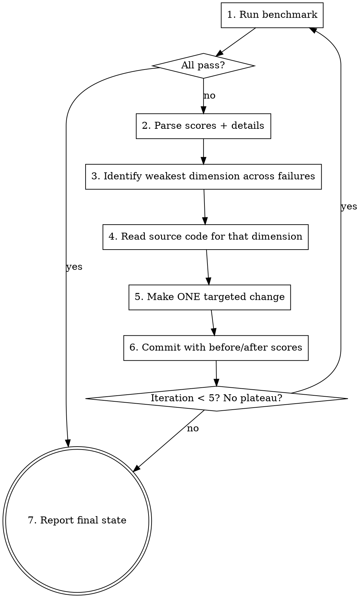

# Optimize Benchmarks

Iterative optimization loop: run benchmarks, analyze failures, fix prompts/code, re-run. Max 5 iterations or until all fixtures pass.

## Arguments

`/optimize-benchmarks <benchmark-command>`

Example: `/optimize-benchmarks pytest tests/benchmarks/test_llm_eval.py -m benchmark -v -s`

If no command given, ask.

## The Loop



## Step 1: Run and Parse

Run the benchmark command. Capture the full output. Extract:
- Per-fixture: overall score, per-dimension scores, pass/fail
- Failure details: `steps_missed`, `catalog_mismatches`, `params_missed`, `is_new_mismatches`, `roles_missed`
- Errors: pydantic validation errors, exceptions (these are bugs, not score issues)

**Fix errors first.** If fixtures crash with exceptions (pydantic validation, import errors), fix those before optimizing scores. These are code bugs, not prompt issues.

## Step 2: Identify Weakest Dimension

Look across ALL failing fixtures. Find the dimension with the lowest average score. Priority when tied:

1. **Catalog Matching** — usually prompt issue (LLM not returning exact catalog names)
2. **New Unit Op Detection** — downstream of catalog matching (wrong match = wrong is_new flag)
3. **Step Detection** — prompt issue (LLM missing or hallucinating steps)
4. **Param Extraction** — prompt or parsing issue (values not extracted or wrong format)
5. **Role Extraction** — prompt issue (roles not identified from document)

## Step 3: Read Source and Diagnose

Read the source files that affect the weakest dimension:

| Dimension | Read these files |
|-----------|-----------------|
| Catalog Matching | System prompt in the parsing function, `match_unit_op()` logic |
| New Unit Op Detection | Same as catalog matching (is_new derives from match) |
| Step Detection | System prompt extraction instructions, output model definition |
| Param Extraction | System prompt param rules, `extract_params()` / `build_param_schema_from_params()` |
| Role Extraction | System prompt role instructions |

Use the failure `details` dict to understand exactly what went wrong — don't guess.

## Step 4: Make ONE Change

Pick the single highest-leverage change for the weakest dimension:

**Prompt fixes** (most common):
- Add few-shot examples showing expected behavior
- Strengthen instruction language ("you MUST match", "NEVER return null when a match exists")
- Restructure how the catalog is presented (grouping, aliases)
- Add explicit rules for edge cases seen in failures

**Code fixes:**
- Fix matching logic (add fuzzy matching, case normalization)
- Fix param parsing (handle "0.5 x 10^6" → 500000)
- Fix model field types (make nullable fields Optional with defaults)
- Fix output validation (catch pydantic errors gracefully)

**ONE change means one conceptual fix.** Strengthening the catalog matching instruction across 3 lines is one change. Adding few-shot examples AND restructuring the catalog format is two changes — pick one.

## Step 5: Commit with Scores

Commit each iteration with before/after scores:

```
fix(prompts): add few-shot catalog matching examples to protocol import

Benchmark iteration 2/5:
  01-buffer-prep:  52% -> 85% (+33%)
  02-cell-culture: 90% -> 91%  (+1%)
  03-protein-a:    50% -> 68% (+18%)
  04-transfection: 51% -> 74% (+23%)
Weakest fixed: catalog_matching (0% -> 65%)
```

## Step 6: Stop Conditions

| Condition | Action |
|-----------|--------|
| All fixtures pass (>= threshold) | Report success, done |
| 5 iterations reached | Report progress, list remaining failures |
| Scores plateau (same 2 runs in a row) | Report, suggest different approach (better model, restructured pipeline) |
| A change causes regression (any fixture drops >10%) | `git revert`, report, ask user |

## Off-Limits

These are NEVER changed during optimization:

- **`expected.json` files** — these are ground truth, not tuning knobs
- **Scoring logic** — don't game the metric
- **Benchmark harness** — don't change how tests run
- **Pass threshold** — unless user explicitly says to

If you're tempted to change expected.json because "the LLM's output is actually better," stop. That's a separate conversation with the user, not an optimization step.

## Progress Table

After each iteration, print:

```
Iteration 2/5 | Change: added few-shot catalog matching examples
+-----------------------------+---------+---------+--------+
| Fixture                     | Before  | After   | Delta  |
+-----------------------------+---------+---------+--------+
| 01-buffer-prep              |   52%   |   85%   |  +33%  |
| 02-cell-culture-passage     |   90%   |   91%   |   +1%  |
| 03-protein-a-purification   |   50%   |   68%   |  +18%  |
| 04-transfection             |   51%   |   74%   |  +23%  |
+-----------------------------+---------+---------+--------+
Passing: 2/4 -> 3/4 | Weakest remaining: param_extraction (68%)
```

## Common Mistakes

- **Changing multiple things at once** — you can't attribute improvements. One change per iteration.
- **Fixing expected.json** — the whole point is to improve the pipeline, not lower the bar.
- **Ignoring exceptions** — pydantic errors and crashes must be fixed first, before prompt tuning.
- **Not reading failure details** — the `details` dict tells you exactly what went wrong. Read it.
- **Over-engineering prompts** — sometimes the fix is code (better matching logic, param normalization), not a longer prompt.
